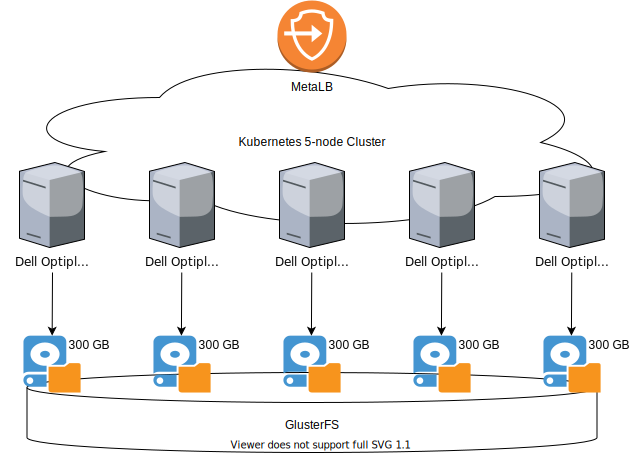

# home-k8s
Setup and Documentation of home k8s test cluster.  This is as much a documentation for future me so I know what I did, as it is intended for anyone else to learn from.

The cluster is made up of five old desktop computer, Dell Optiplex 380, each with a 300 GB disk which I came by very cheaply.  Upon them I installed Ubuntu Server 20.04.2, along with GluterFS (for replicated, shared disk) and microk8s (for a kubernetes implementation).  To access k8s resources from outside the cluster (i.e., the rest of my home network) I used MetalLB which is conveniently enabled via microk8s with a single command.

Here's a simple diagram of the setup:



# GlusterFS Setup
GlusterFS is a file-system driver for clustering servers' worth of disk over a network for redudancy/replication or striping such that the collection of disks is then presented as a single unit.

In my case, I had a need for a small (10GB) persistent volume in k8s for which I wanted any of the five servers to be able to access it, and I wanted it to have no single point-of-failure (i.e., a single server exposing a disk folder over NFS was undesirable).  In this case GlusterFS fit my need well because I could replicate the disk contents to all five servers (i.e., I'd have to lose all five servers' disks before data loss would occur) and then have each server locally mount the GlusterFS volume to be used.

## Installing GlusterFS

In Ubuntu there are two packages to install, one for the GlusterFS server component and one for the client.  Both need to be installed on all k8s nodes since each server is both a server and client:

```
apt install glusterfs-server glusterfs-client
```

Once GlusterFS server is installed and running, the cluster for GlusterFS can be created by having one server probe the others, e.g.,

```
gluster peer probe minerva
gluster peer probe molly
gluster peer probe rita
gluster peer probe slappy
```

minerva, molly, rita, and slappy are the server names.

## Setting up Logical Volume for GlusterFS to Use

In Ubuntu disks are partitioned and logical volumes created.  In my case about half of the 300 GB disk was already consumed by the logical volume Ubuntu setup for itself to use and so I needed to create a 10 GB logical volume in what was left:

```
lvcreate -L 10G -n gluster-10-lv ubuntu-vg
mkfs.ext4 /dev/ubuntu-vg/gluster-10-lv
mkdir /mnt/gluster-10
mount /dev/ubuntu-vg/gluster-10-lv /mnt/gluster-10/
```

## Creating the GlusterFS Volume

Creating the GlusterFS volume needs to be done only once on a single server of the GlusterFS cluster:

```
gluster volume create glusterv-10 replica 5 katie:/mnt/gluster-10 minerva:/mnt/gluster-10 molly:/mnt/gluster-10 rita:/mnt/gluster-10 slappy:/mnt/gluster-10 force
gluster volume start glusterv-10
```

The replica 5 options specify that 5 copies of the data should be preserved and the list of five servers and their mount points is where those five copies will be kept.  It's possible with GlusterFS to stripe data, but I wanted each server to have a full copy of the data (why not, it's just 10 GB).

## Mounting the GlusterFS Volume

Once the GlusterFS volume is created, each server simply needs to mount it locally:

```
mount -t glusterfs localhost:/glusterv-10 /data/data-10
```

Henceforth any read of /data/data-10 will happy locally on each server, but any write will be replicated to all four other servers keeping the shared GlusterFS volume in sync across all five servers.

